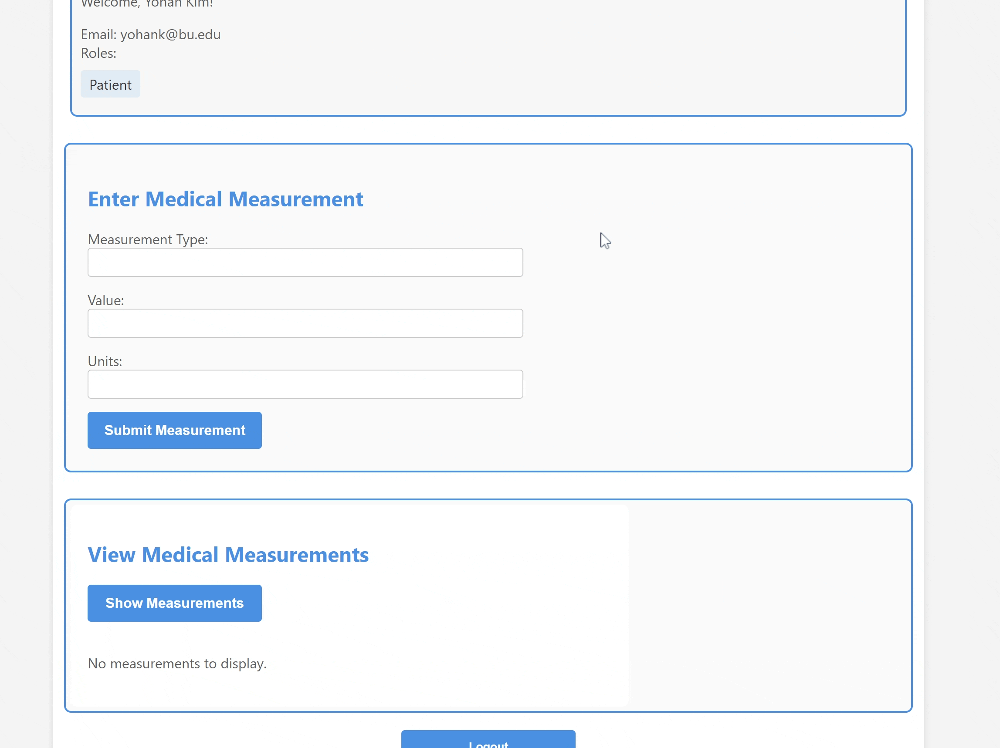
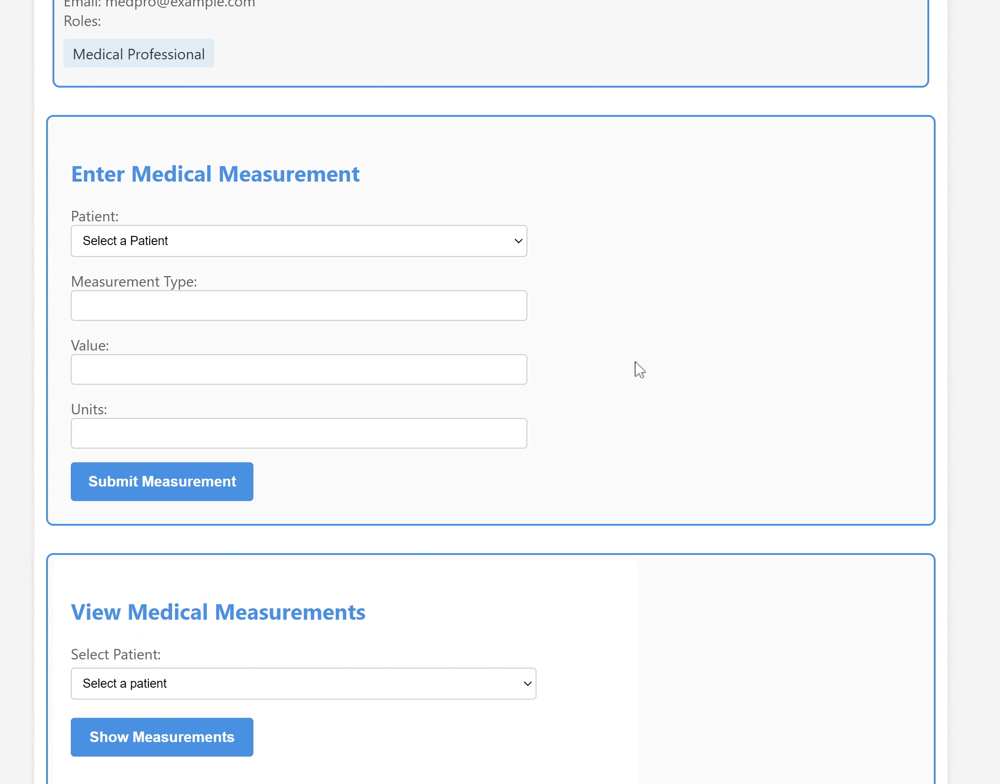
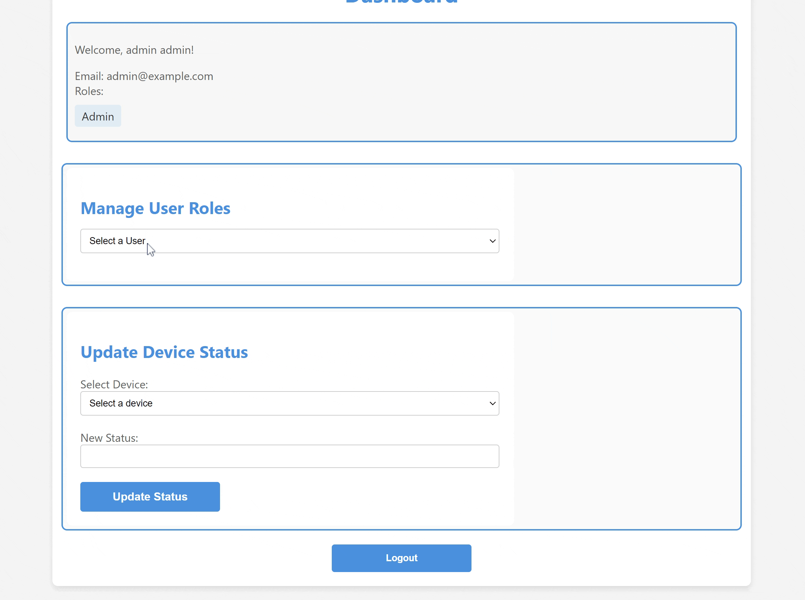

# Health Monitoring System 

The Health Monitoring System is a web application designed to facilitate the management and viewing of medical measurements for both patients and medical professionals. It allows authorized users to view, update, and manage measurements associated with specific patients.

## User Features

- **Patient**
  - Patient can enter measurement at any time
  - Patient can view their medical measurements
- **Medical Professional**
  - Browse Patients
  - Assign a medical device to a Patient
  - MP can input data for any patient
- **Admin**
  - Assign and Change Roles to users
  - Ability to disable or enable any device maker or application developer

## Installation
1. Clone the repository: `git clone <repository_url>`
2. Navigate to the project directory: `cd health-monitoring-system`
3. Navigate to the web folder: `cd web`
3. Install dependencies: `npm install`

## Usage
1. Start the development server in health-monitoring-system/web: `npm run dev`
2. Access the application in your web browser at `http://localhost:3000`
3. You may test the application with three pre-made accounts or signup and make your own account. (Admin actions only available on the premade admin account)
- Patient account:
  - username: patient
  - passoword: patient123
- Medical Professional account:
  - username: medpro
  - passoword: medpro123
- Admin account:
  - username: admin
  - passoword: admin123

## Technologies Used
- **Frontend**: React.js
- **Backend**: Flask, Python
- **Database**: SQLalchemy
- **Authentication**: JSON Web Tokens (JWT)
- **API Requests**: Axios

## Example of application
- Patient:

- Medical Professional:

- Admin:
